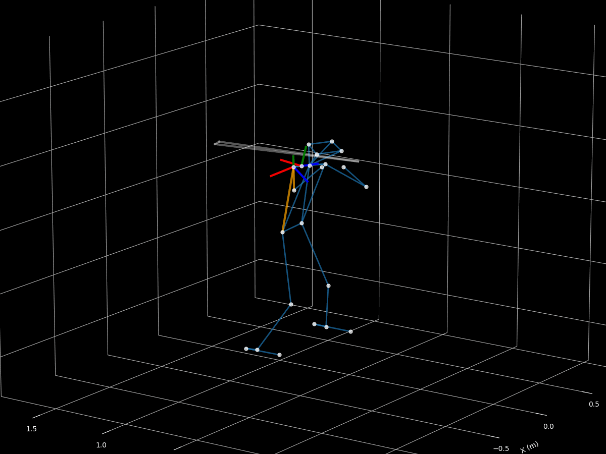

# Reproducing [Driveline](https://www.drivelinebaseball.com/)'s Joint Angles from the [Open Biomechanics Project](https://www.openbiomechanics.org/) 

  
  

### References

Journal of Biomechanic's recommendations for [upper-body](https://media.isbweb.org/images/documents/standards/Wu%20et%20al%20J%20Biomech%2038%20(2005)%20981%E2%80%93992.pdf) and [lower-body](https://media.isbweb.org/images/documents/standards/Wu%20et%20al%20J%20Biomech%2035%20(2002)%20543%E2%80%93548.pdf) joint coordinate systems.

